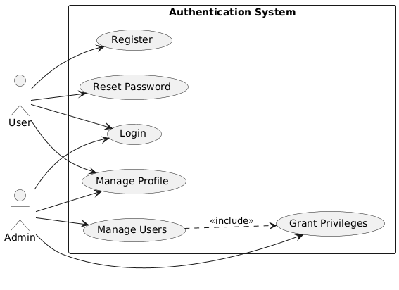
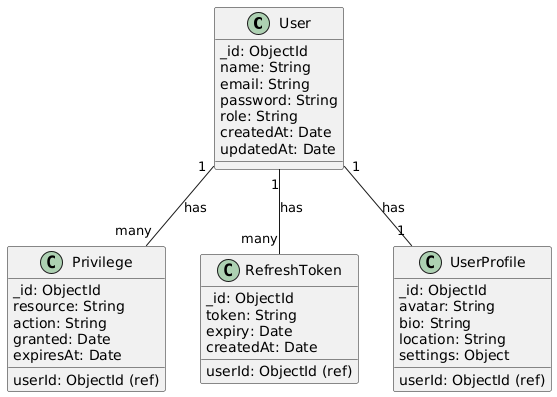
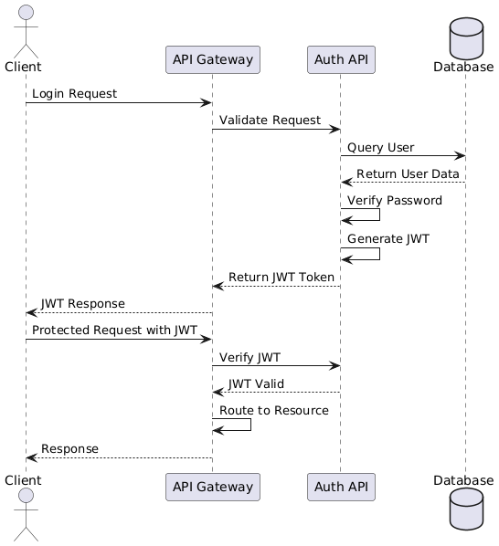
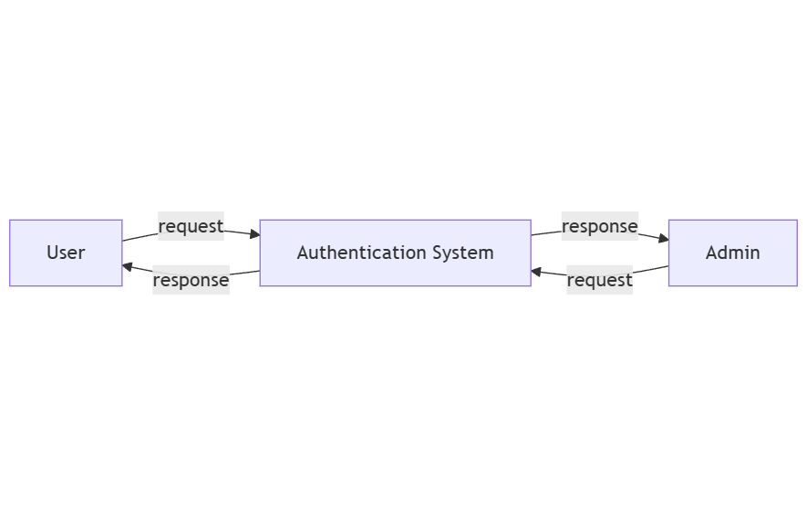
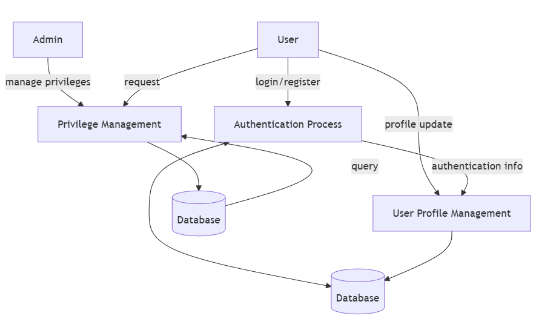
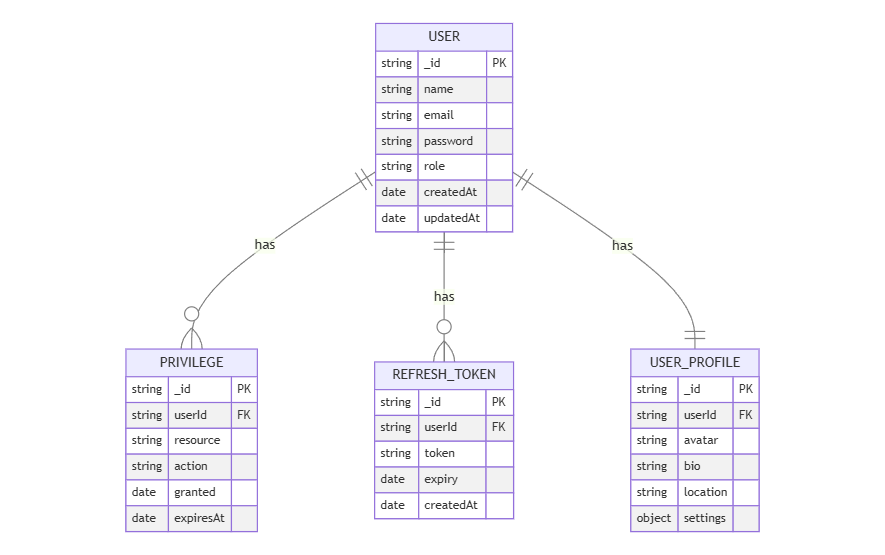
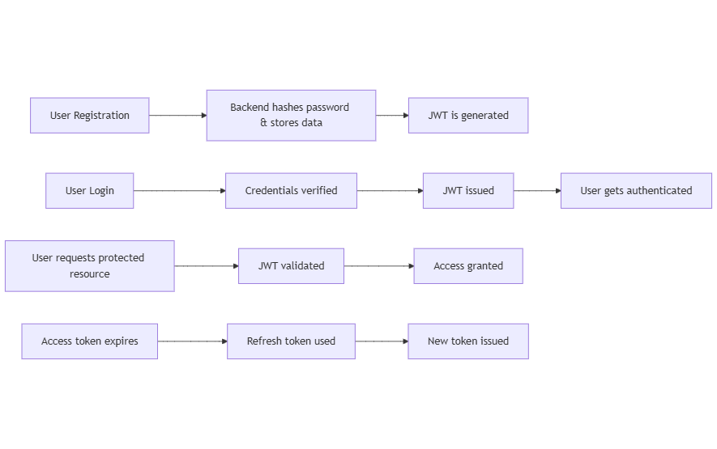

# Full-Stack Authentication System Project Report

## Front Page

**Project Title:** Full-Stack Authentication System  
**Author:** Parth Katke  
**Date:** March 30, 2025  

---

## Introduction

### Background Details

In the contemporary digital landscape, the necessity for robust authentication systems has become paramount. This project endeavors to implement a comprehensive authentication system, addressing the critical need for secure user management and access control in modern web applications. The system is meticulously designed to encompass both client-side (frontend) and server-side (backend) components, ensuring a robust and scalable solution. The system supports user registration, login, role-based access control, and privilege management, thereby providing a holistic approach to user authentication and authorization.

### Project Overview

The authentication system is architected as a modular full-stack application. The frontend, constructed using React, provides an intuitive user interface for registration, login, and profile management. The backend, developed using Node.js with Express, is responsible for handling user authentication, authorization, and data management. A MongoDB database is employed to store user credentials and related information. The system incorporates industry-standard security practices, including JWT-based authentication and bcrypt password hashing, to ensure the integrity and confidentiality of user data.

---

## Problem Statement

In the realm of web applications, the implementation of robust authentication and authorization mechanisms is indispensable for protecting sensitive data and ensuring secure access. Developing these features from scratch can be an arduous and time-consuming endeavor, often resulting in vulnerabilities if not executed with precision. This project aims to provide a reusable and secure authentication system that can be seamlessly integrated into various web applications, thereby reducing development time and enhancing overall security.

### The authentication system specifically addresses the following requirements:

- Supports secure user registration and login
- Implements JWT-based authentication
- Provides role-based access control (RBAC)
- Ensures robust security measures (e.g., password hashing, token expiration, and request validation)

---

## Design of Solution

### Project Structure

The project adheres to a modular structure, segregating the frontend and backend components to enhance maintainability and scalability.

#### Frontend (client):
- React-based user interface
- Components for login, registration, dashboard, user management, and settings
- Axios for API communication
- React Router for navigation

#### Backend (server):
- Node.js with Express framework
- RESTful API endpoints for authentication and user management
- JWT for authentication
- bcrypt for password hashing
- Mongoose for MongoDB interaction

#### Database:
- MongoDB for storing user data and privileges

---

## UML Diagrams

### Use Case Diagram

### Class Diagram

### ER Diagram

### Sequence Diagram

---

## HLD, LLD, and DFD

### High-Level Design (HLD)

- The frontend (React) communicates with the backend (Node.js/Express) via API calls.
- The backend interacts with MongoDB for data persistence.
- JWT is utilized for secure authentication.

### Low-Level Design (LLD)

- Detailed component design for the frontend (e.g., Login Form, Dashboard Components).
- Detailed API endpoint design for the backend (e.g., `/api/auth/login`, `/api/users`).
- Schema definitions for MongoDB (e.g., User Schema, Privilege Schema).

### Data Flow Diagram (DFD)

- **Level 0 DFD:** Illustrates the overall system with external entities (User, Admin) and the system process.
- **Level 1 DFD:** Decomposes the system process into sub-processes (Authentication, User Management, Privilege Management).

---

## Implementation Details

### Tools Used

#### Technology Stack

| Component | Technology |
|-----------|------------|
| **Frontend** | React, Material UI, Axios, React Router |
| **Backend** | Node.js, Express.js |
| **Database** | MongoDB (Mongoose ORM) |
| **Authentication** | JWT (JSON Web Token), bcrypt |
| **Security** | Helmet, CORS, Express Validator |
| **Development Tools** | Postman, GitHub CI/CD |

### API Endpoints

| Method | Endpoint | Description |
|--------|---------|-------------|
| POST | `/api/auth/register` | Registers a new user |
| POST | `/api/auth/login` | Authenticates a user and returns JWT |
| POST | `/api/auth/logout` | Invalidates refresh token |
| GET | `/api/user/profile` | Retrieves user profile details |
| POST | `/api/auth/token` | Generates new access token using refresh token |
| GET | `/api/users` | Retrieves all users (admin only) |
| PUT | `/api/users/:id` | Updates user information (admin or owner) |
| DELETE | `/api/users/:id` | Deletes a user (admin only) |

### Security Measures

To ensure a secure authentication process, the system implements the following security features:

- **Password Hashing:** Uses bcrypt to securely store passwords.
- **JWT Authentication:** Access and refresh tokens for stateless authentication.
- **Role-Based Access Control (RBAC):** Limits access based on user roles (e.g., admin, user).
- **Rate Limiting:** Prevents brute force attacks using `express-rate-limit`.
- **Input Validation:** Prevents SQL injections and XSS attacks using `express-validator`.
- **CORS & Helmet:** Secures HTTP headers and prevents CORS attacks.

### Error Handling Strategy

| Error Type | Description | HTTP Status |
|------------|-------------|--------------|
| Invalid Credentials | Wrong email/password | 401 Unauthorized |
| Token Expired | JWT expired | 403 Forbidden |
| Missing Token | No token provided | 401 Unauthorized |
| Access Denied | User lacks permission | 403 Forbidden |
| Validation Error | Invalid input data | 400 Bad Request |
| Resource Not Found | Requested resource doesn’t exist | 404 Not Found |
| Server Error | Internal server error | 500 Server Error |

---

## Conclusion

This project exemplifies the development of a robust and scalable authentication system using modern web technologies. Future improvements could include:

- OAuth integration for social login (Google/Facebook)
- Multi-factor authentication (MFA) for enhanced security
- Advanced audit logging for security compliance
- User activity tracking and analytics

---

## References
- [React Documentation](https://reactjs.org/)
- [Node.js Documentation](https://nodejs.org/)
- [Express Documentation](https://expressjs.com/)
- [MongoDB Documentation](https://www.mongodb.com/)
- [JSON Web Tokens (JWT)](https://jwt.io/)
- [Material UI](https://mui.com/)
